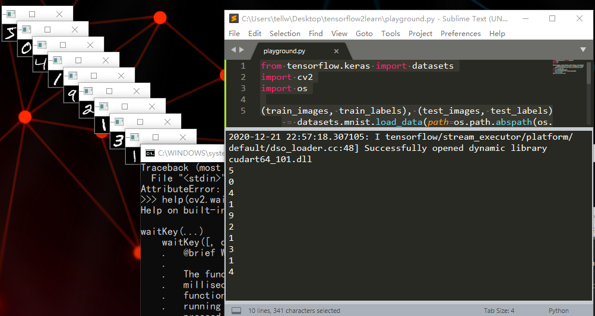

[toc]

# MnistLearnRec
mnist数据学习和识别

# 程序说明
ckpt目录存放训练出来的模型，data_set_tf2放的是tensorflow下载的mnist数据集文件，mnistRecQtMain是画图辨识手写数字的Qt程序，train是训练模型文件，test是测试模型识别结果的文件，playground是开发中处理疑问的测试程序
playground.py运行结果如图所示


# 项目运行
本项目使用python语言写成，环境python3.8.6，需要的python第三方包有PyQt5, numpy, cv2(opencv-python), PIL, tensorflow

训练好的模型放在ckpt目录下，若要启动Qt程序直接看模型的处理结果：命令```python MnistRecQtMain.py```

# TODO
1. 用户输入手写数字会有模型辨识错误的情况，将新的图片和正确结果输入模型，提高模型的准确率，持续学习
2. 支持用户输入图片
3. 训练模型的数据集是黑底白字图片，但实际上白底黑字图片识别正确率还说得过去，让模型支持复杂场景的数字识别
4. 画布能展示模型输入的图片长什么样子
5. test程序的main函数打算写从测试集里取出一些图片并让模型预测其值让人观测其预测的准确性

# 参考链接
[TensorFlow 2.0 (五) - mnist手写数字识别(CNN卷积神经网络)](https://geektutu.com/post/tensorflow2-mnist-cnn.html)
[用PyQt5做画矩形的GUI程序](https://blog.csdn.net/z1314520cz/article/details/82054112)